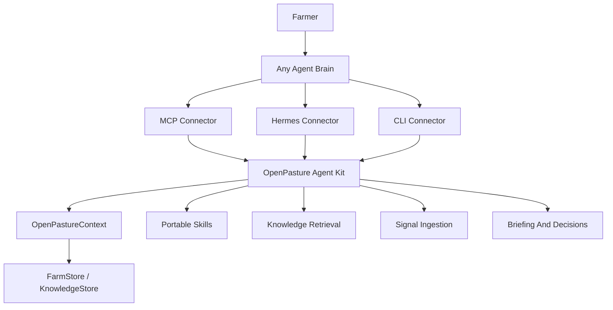

# Architecture

The agent kit owns portable farm operating behavior. Connectors adapt that
behavior to a runtime.

## Layers

### Context

`OpenPastureContext` initializes stores, knowledge retrieval, data directories,
skill directories, active farm state, and optional scheduling.

### Tool Catalog

`src/openpasture/toolkit.py` defines each executable farm capability once.
Connectors consume the catalog instead of duplicating registration logic.

### Connectors

- CLI exposes JSON commands for agents, scripts, and cron.
- MCP exposes tools and skill resources to MCP-capable clients.
- Hermes registers tools and hooks with the Hermes runtime.

### Domain

`src/openpasture/domain/` defines farms, paddocks, herds, observations, movement
decisions, farmer actions, and knowledge entries without runtime coupling.

### Storage

`FarmStore` and `KnowledgeStore` protocols keep storage interchangeable. SQLite
is the default self-hosted backend. Convex is the hosted direction.

### Skills And Knowledge

Skills are portable runbooks. Knowledge entries are structured practitioner
lessons with provenance. Both should stay useful across connectors.

## Design Rule

If behavior helps any agent operate a farm, keep it in the kit. If behavior only
adapts the kit to one runtime, keep it in a connector.

Source docs: `docs/architecture.md` and `docs/cloud-boundary.md`.
