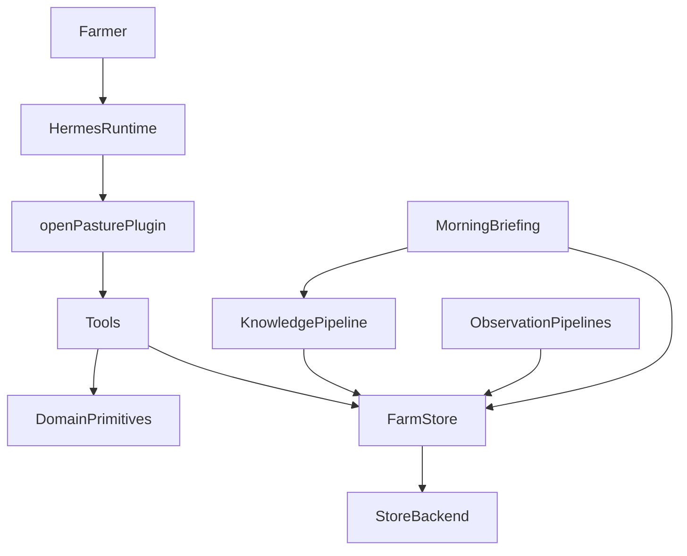
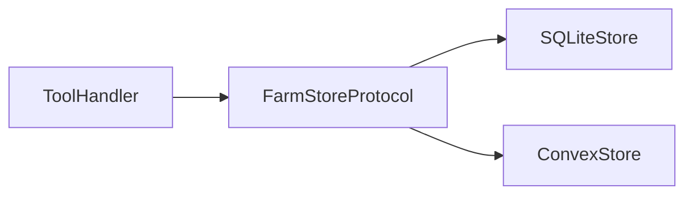

# Architecture

`openPasture` is a Hermes plugin organized around five subsystems:

1. tools,
2. domain,
3. knowledge,
4. ingestion,
5. briefing.

The key design rule is simple: if behavior can remain in the self-hostable agent, keep it in the agent.

## System Overview

## The Five Subsystems

### Tools

`src/openpasture/tools/` contains Hermes-callable capabilities.

Examples:

- register a farm,
- add paddocks,
- record an observation,
- ingest a YouTube source,
- search prior knowledge,
- generate a morning brief,
- approve or reject a plan.

Tools should stay thin. They validate inputs, call into domain logic and store backends, and return structured outputs.

### Domain

`src/openpasture/domain/` defines the shared language of the system.

These objects should remain framework-agnostic. They model farms, paddocks, herds, observations, knowledge entries, and movement decisions.

### Knowledge

`src/openpasture/knowledge/` handles ancestral knowledge.

The core flow is:

1. acquire a source such as a YouTube transcript,
2. extract structured lessons,
3. embed them,
4. retrieve them during planning.

### Ingestion

`src/openpasture/ingestion/` turns external signals into `Observation` records.

Initial pipelines include:

- weather,
- satellite imagery,
- farmer photos.

### Briefing

`src/openpasture/briefing/` assembles the morning brief.

It should answer four questions:

- what is true,
- what should happen,
- why,
- what additional observation would help most.

## Storage Abstraction

The self-hosted and hosted deployments share the same agent, but not necessarily the same storage backend.

`FarmStore` is the seam. It keeps the agent independent from any one infrastructure stack.

- `SQLiteStore` supports self-hosting.
- `ConvexStore` supports the hosted wrapper and dashboard synchronization.

## Deployment Modes

### Self-Hosted

- Hermes runs on the farmer's machine or VPS.
- `openPasture` uses `SQLiteStore`.
- messaging is configured directly in Hermes.
- scheduling happens inside the agent process.

### Hosted

- Hermes still runs the same plugin.
- `openPasture` uses `ConvexStore`.
- provisioning, billing, and dashboarding are external wrappers.

## Integrations

The agent may connect to:

- an LLM provider for reasoning and embeddings,
- YouTube transcript sources for knowledge ingestion,
- weather APIs,
- STAC-compatible satellite sources,
- optional telemetry providers such as Braintrust or PostHog.

The hosted platform may additionally connect to Clerk, Stripe, Vercel, and Convex, but those integrations should not become prerequisites for the core agent.

## Context Injection

Hermes hooks should be used to make the agent feel situationally aware without hard-coding behavior into infrastructure.

Typical hook responsibilities:

- inject active farm context at session start,
- inject recent movement context before planning,
- record telemetry around tool calls and LLM turns.

## Litmus Test

Before moving behavior out of the agent, ask:

> Can a self-hosted farmer still use this capability if we keep it in the agent?

If the answer is yes, keep it in the agent.
