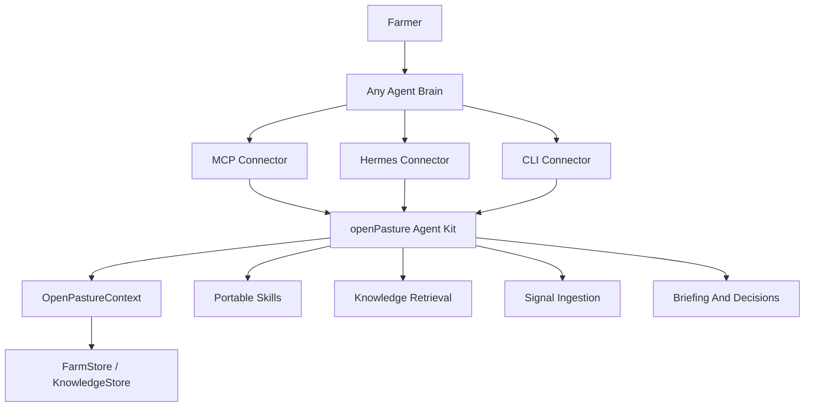

# Architecture

This repository is the agent kit for `openPasture`, the agent-native farm operating toolkit. The ideal runtime is a coding agent with CLI access, skills, files, and code execution. MCP is a supported integration method for chat assistants and other MCP-capable clients. The kit owns the portable farming tools, skills, state access, and connector surfaces.

## Kit Layers

### Context

`src/openpasture/context.py` is the runtime-agnostic kit kernel. It initializes stores, knowledge retrieval, data directories, skill directories, active farm state, and optional scheduling.

### Tool Catalog

`src/openpasture/toolkit.py` defines each executable farm capability once. A `ToolSpec` includes the name, JSON schema, handler, description, tags, and related skills. Connectors consume this catalog instead of duplicating registration tables.

### Connectors

`src/openpasture/connectors/hermes.py` registers catalog tools and hooks with Hermes.

`src/openpasture/connectors/mcp.py` exposes the catalog and skills to MCP-capable agents.

`src/openpasture/cli.py` exposes the same capabilities as JSON-in/JSON-out shell commands.

### Tools

`src/openpasture/tools/` contains framework-neutral handlers. They accept a payload dict and return JSON. This shape works for Hermes, MCP, CLI, cron, tests, and future adapters.

### Domain

`src/openpasture/domain/` defines farm primitives: farms, paddocks, herds, observations, movement decisions, knowledge entries, farmer actions, and data pipelines. These objects remain framework-agnostic.

### Storage

`FarmStore` and `KnowledgeStore` protocols keep storage interchangeable.

- SQLite is the default self-hosted backend.
- Convex is the hosted/cloud backend direction.
- Future backends should implement the protocols rather than changing tool behavior.

### Knowledge

`src/openpasture/knowledge/` handles seed loading, lesson storage, embedding, retrieval, ingestion queues, and batch manifests. `seed/` contains durable foundational knowledge.

### Skills

`skills/` contains portable markdown runbooks. Skills are not Hermes-only. Connectors can list or read them so an agent can load the operating procedure it needs.

### Briefing

`src/openpasture/briefing/` separates context assembly from the default heuristic advisor. Context assembly gathers farm state, observations, weather, and relevant knowledge. The default advisor can still emit `MOVE`, `STAY`, or `NEEDS_INFO`, but a stronger agent brain can reason over the same context itself.

## Design Rule

If behavior helps any agent operate a farm, keep it in the kit. If behavior only adapts the kit to one runtime, keep it in a connector.
