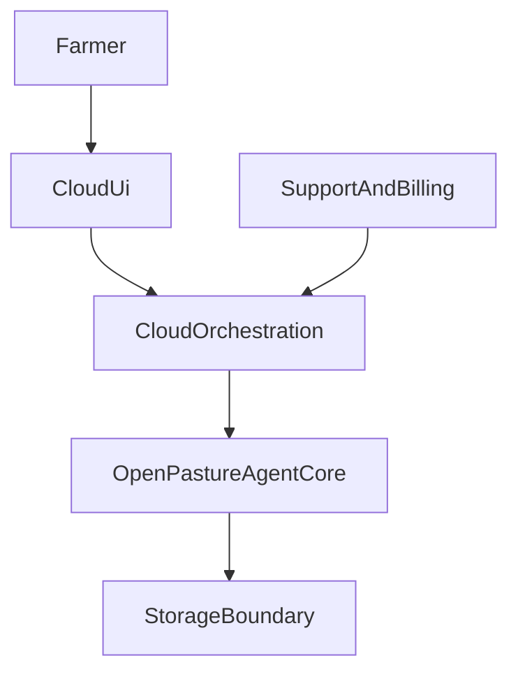

# Cloud Boundary

`openPasture` is the open-source agent core.

The hosted OpenPasture product is a separate, monetized layer that wraps this
agent with managed infrastructure and a proprietary product surface.

## Core Rule

The agent is the product.

This repository owns the logic that a self-hosting farmer should be able to run
without the hosted platform:

- farm onboarding primitives
- paddock and herd state
- observation recording
- morning brief generation
- movement recommendation logic
- knowledge retrieval and ingestion
- self-hosted scheduling behavior
- self-hosted validation and runtime packaging

The separate cloud repository should own the managed wrapper:

- account management
- authentication and authorization
- billing and subscriptions
- hosted environment provisioning
- messaging transport orchestration
- backups and recovery
- premium UI and mobile/web product surfaces
- support and admin tooling
- hosted analytics and operations

## Architecture Direction

## Guardrails

- Do not move core grazing reasoning into the cloud UI or cloud-only services.
- Do not make the OSS agent unusable in order to drive hosted adoption.
- Do not add hosted-only concepts to this repo unless self-hosted farmers need
  the same behavior.
- Prefer wrapping existing agent tools and workflows over reimplementing them in
  the cloud product.

## Storage Boundary

This repo defaults to SQLite and keeps storage behind protocol interfaces.

That means the cloud layer can introduce hosted storage and orchestration later,
but the farm reasoning loop should continue to work against the same logical
contracts.

## Practical Meaning

If a feature is required for a self-hosted farmer to run the agent, it belongs
here.

If a feature is primarily about hosting, monetization, managed UX, or internal
operations, it belongs in the cloud repo.
