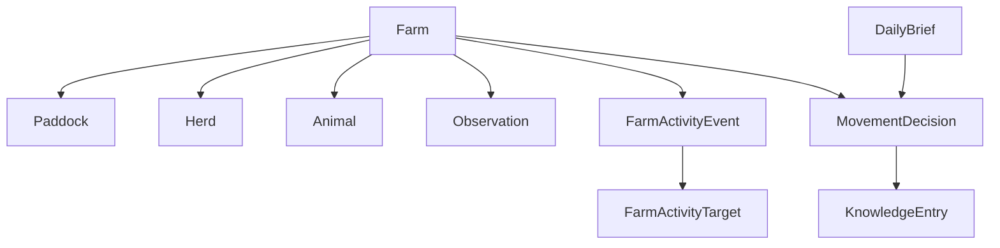

# Domain Model

The domain layer gives `openPasture` a stable internal language.

## Core Entities

### Farm

The top-level management unit.

A farm contains paddocks, herds, infrastructure, and observations. It also carries important context such as timezone and the farm's primary location.

### Paddock

A bounded grazing unit within a farm.

A paddock stores geometry, area, management status, and any notes that affect movement planning.

### Herd

A livestock group managed together.

A herd tracks species, count, optional animal-unit assumptions, and current paddock assignment.

### Animal

An individual animal with durable identity and current state.

An animal tracks stable fields such as tag, species, sex, breed, herd assignment, current paddock, parentage, lifecycle status, and notes. Health checks, breeding events, treatments, movements, images, and other historical detail should be recorded as activity events instead of growing unbounded arrays on the animal row.

### Observation

A time-bound signal about the state of the farm.

The observation model is intentionally unified. A weather report, a farmer note, a photo analysis, and a satellite-derived NDVI summary should all be expressible as observations.

### FarmActivityEvent

The append-only historical source of truth for profile feeds.

Every meaningful farm fact that should later appear in a CRM-style history feed should be written as a `FarmActivityEvent`. Observations remain a useful source-specific shape, but notes, images, weather reports, movement updates, grazing decisions, daily briefs, animal health records, treatments, breeding records, lifecycle events, and imported reports should all emit activity events.

An activity event uses a stable envelope plus flexible typed payload:

- stable fields: event id, farm id, event type, source, occurred time, recorded time, title, body, summary, provenance, visibility,
- typed payload: event-specific detail such as weather readings, treatment dose, breeding outcome, or image analysis,
- targets: indexed links to every profile that should show the event: farm, pasture, paddock, herd, animal, or another land unit,
- attachments: images, reports, files, and other media associated with the event.

This lets OpenPasture keep a fluid model that can grow with new data sources while preserving fast profile feeds.

### MovementDecision

The recommendation produced for a decision window.

A movement decision should record:

- recommended action,
- timing window,
- source and destination paddocks when applicable,
- reasoning,
- confidence,
- status after farmer response.

### DailyBrief

The human-readable artifact delivered to the farmer.

A brief wraps a movement decision with context, key observations, and a targeted request for more information when useful.

### KnowledgeEntry

A structured lesson extracted from a trusted source.

The initial four knowledge entry types are:

- `principle`,
- `technique`,
- `signal`,
- `mistake`.

## Relationship Sketch

## Design Notes

- Prefer explicit objects over weak dictionaries.
- Keep these types free of Hermes-specific logic.
- Keep room for geospatial representation without requiring a UI.
- Preserve provenance on every recommendation and knowledge record.
- Treat `FarmActivityEvent` as the historical source of truth. Current-state rows answer "what is true now"; activity events answer "what happened and why does this profile remember it?"
