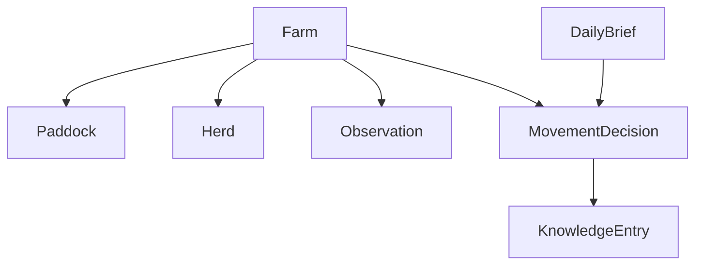

# Domain Model

The domain layer gives `openPasture` a stable internal language.

## Core Entities

### Farm

The top-level management unit.

A farm contains paddocks, herds, infrastructure, and observations. It also carries important context such as timezone and the farm's primary location.

### Paddock

A bounded grazing unit within a farm.

A paddock stores geometry, area, management status, and any notes that affect movement planning.

### Herd

A livestock group managed together.

A herd tracks species, count, optional animal-unit assumptions, and current paddock assignment.

### Observation

A time-bound signal about the state of the farm.

The observation model is intentionally unified. A weather report, a farmer note, a photo analysis, and a satellite-derived NDVI summary should all be expressible as observations.

### MovementDecision

The recommendation produced for a decision window.

A movement decision should record:

- recommended action,
- timing window,
- source and destination paddocks when applicable,
- reasoning,
- confidence,
- status after farmer response.

### DailyBrief

The human-readable artifact delivered to the farmer.

A brief wraps a movement decision with context, key observations, and a targeted request for more information when useful.

### KnowledgeEntry

A structured lesson extracted from a trusted source.

The initial four knowledge entry types are:

- `principle`,
- `technique`,
- `signal`,
- `mistake`.

## Relationship Sketch

## Design Notes

- Prefer explicit objects over weak dictionaries.
- Keep these types free of Hermes-specific logic.
- Keep room for geospatial representation without requiring a UI.
- Preserve provenance on every recommendation and knowledge record.
